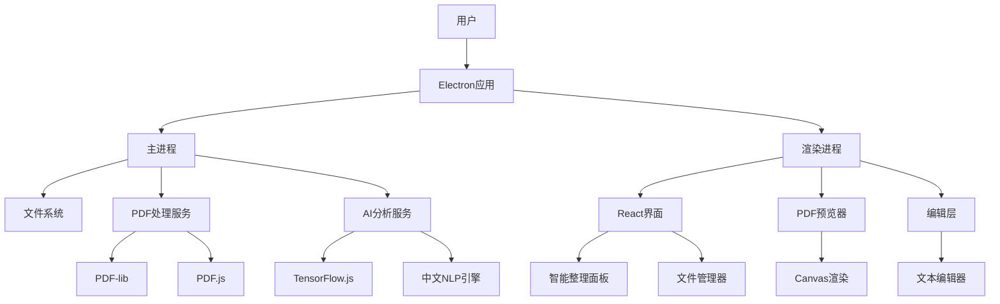
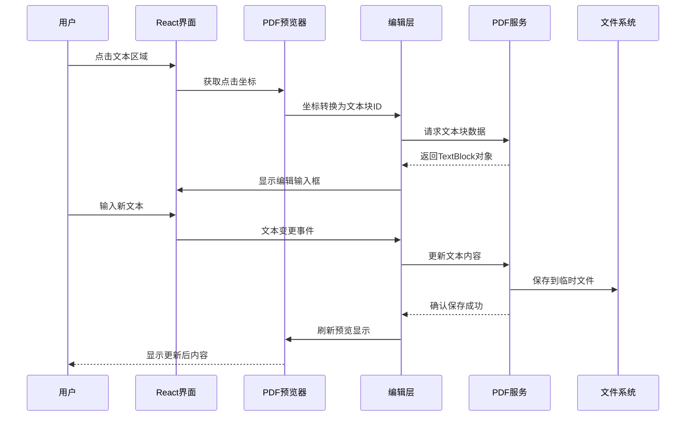
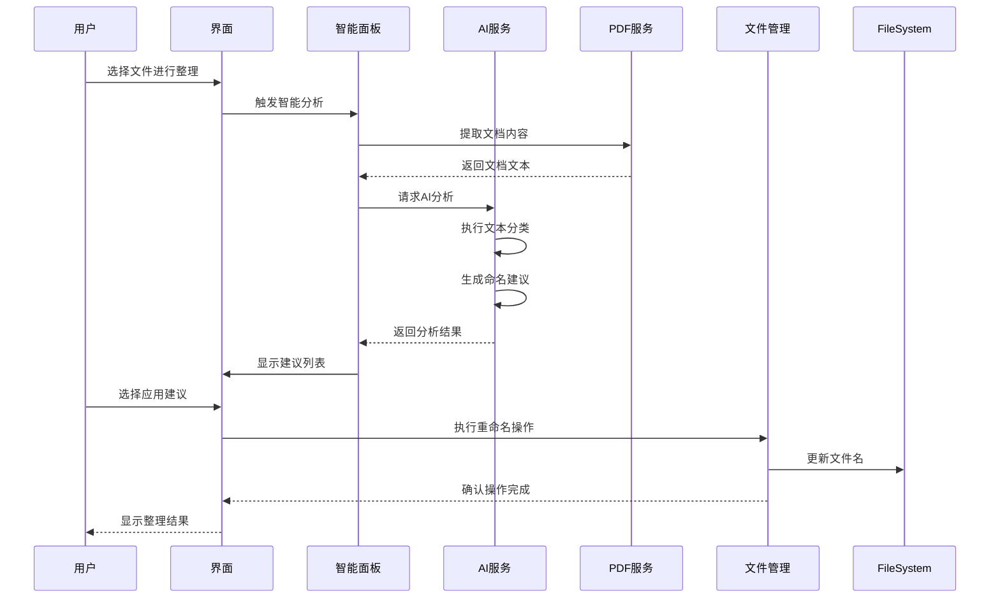
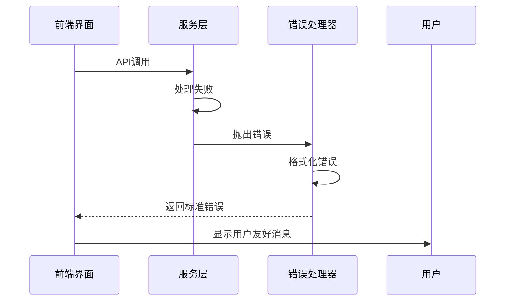

# PDF Toolkit Pro 全栈架构文档

## 1. Introduction

这份文档为PDF Toolkit Pro建立完整的技术架构，这是一个革命性的桌面PDF处理工具，核心特色是"预览即编辑"功能。

**项目特点：**
- 桌面应用（非Web应用）
- 本地处理，保护隐私
- AI驱动的智能整理
- 中文用户优化

**架构目标：**
- 支持实时PDF编辑的高性能架构
- 本地AI处理能力
- 跨平台桌面应用框架
- 模块化和可扩展设计

### Change Log

| Date | Version | Description | Author |
|------|---------|-------------|---------|
| 2025-01-21 | v1.0 | 初始架构文档创建 | Winston (Architect) |
| 2025-01-21 | v1.1 | 同步实际实现状态，更新技术栈版本 | Winston (Architect) |

## 2. High Level Architecture

### Technical Summary

PDF Toolkit Pro采用**Electron桌面应用架构**，结合本地AI处理和实时PDF编辑能力。主架构包括Electron主进程负责应用生命周期管理，React渲染进程提供用户界面，Node.js后台服务处理PDF解析和AI分析。核心创新在于PDF.js与Canvas API的深度集成，实现预览界面中的直接文本编辑。本地TensorFlow.js提供AI驱动的文件整理功能，确保用户隐私的同时提供智能化体验。整体架构优化了桌面应用的性能和响应速度，支持100MB大文件处理和3秒内启动时间。

### Platform and Infrastructure Choice

**平台：** Windows优先，后续扩展macOS
**核心服务：** Electron主进程、渲染进程、本地文件系统
**部署方式：** 本地安装包，无需服务器部署

### Repository Structure

**结构：** 单仓库包含Electron主进程、React前端、共享库
**工具：** 使用npm workspaces进行包管理
**组织策略：** 按功能模块划分（PDF处理、AI功能、UI组件）

### High Level Architecture Diagram



### Architectural Patterns

- **桌面应用架构**：Electron多进程架构 - _理由：_隔离UI和业务逻辑，提高稳定性和安全性
- **组件化UI**：React函数组件 + TypeScript - _理由：_类型安全和组件复用，适合复杂桌面界面
- **服务层模式**：独立的PDF和AI服务模块 - _理由：_业务逻辑解耦，便于测试和维护
- **观察者模式**：文件状态和编辑状态管理 - _理由：_实时同步预览和编辑状态
- **策略模式**：多种PDF处理策略 - _理由：_支持不同类型PDF文档的处理需求

## 3. Tech Stack

| 类别 | 技术 | 版本 | 用途 | 选择理由 |
|------|------|------|------|----------|
| 桌面框架 | Electron | 27.3.11 | 跨平台桌面应用框架 | 成熟生态、快速开发、丰富的Node.js库支持 (降级解决兼容性问题) |
| 前端语言 | TypeScript | 5.x | 类型安全的JavaScript | 大型项目必需的类型安全，减少运行时错误 |
| 前端框架 | React | 18.x | 用户界面构建 | 组件化开发、丰富生态、团队熟悉度高 |
| UI组件库 | Tailwind CSS | 3.x | 样式框架 | 快速开发、高度可定制、现代设计系统 |
| 状态管理 | Zustand | 4.x | 轻量级状态管理 | 简单易用、TypeScript友好、适合中等复杂度应用 |
| 后端语言 | Node.js | 20.x LTS | 服务端JavaScript运行时 | 与前端技术栈统一、丰富的PDF处理库 |
| 后端框架 | Express | 4.x | Web应用框架 | 轻量级、中间件丰富、适合API服务 |
| PDF处理 | PDF.js | 4.x | PDF渲染和解析 | Mozilla官方、功能完整、预览即编辑核心依赖 |
| PDF编辑 | PDF-lib | 1.17.x | PDF文档操作 | 纯JavaScript、支持文本编辑、无需外部依赖 |
| AI框架 | TensorFlow.js Node | 4.x | 本地机器学习 | Node.js环境AI处理、中文NLP支持、离线处理 (使用tfjs-node解决Electron兼容性) |
| 构建工具 | Vite | 5.x | 前端构建工具 | 快速热重载、现代化构建、Electron集成良好 |
| 打包工具 | Electron Builder | 24.x | 应用打包分发 | 官方推荐、支持多平台、自动更新机制 |
| 测试框架 | Jest | 29.x | 单元测试 | 成熟稳定、React生态集成、快照测试 |
| E2E测试 | Playwright | 1.x | 端到端测试 | 现代化、跨浏览器、Electron支持 |
| 代码规范 | ESLint + Prettier | 最新 | 代码质量和格式化 | 团队协作必需、TypeScript集成 |
| 版本控制 | Git | 2.x | 源码管理 | 行业标准、分支管理、协作开发 |

## 4. Data Models

### PDFDocument

**用途：** 表示PDF文档的完整信息，包括文件元数据、内容结构和编辑状态

```typescript
interface PDFDocument {
  id: string;
  filePath: string;
  fileName: string;
  suggestedName?: string;
  fileSize: number;
  pageCount: number;
  createdAt: Date;
  modifiedAt: Date;
  isModified: boolean;
  category?: DocumentCategory;
  tags: string[];
  metadata: PDFMetadata;
  pages: PDFPage[];
}
```

**关系：**
- 一对多关系：PDFDocument -> PDFPage[]
- 一对一关系：PDFDocument -> PDFMetadata

### PDFPage

**用途：** 表示PDF文档中的单个页面，支持预览即编辑功能

```typescript
interface PDFPage {
  pageNumber: number;
  width: number;
  height: number;
  rotation: number;
  textBlocks: TextBlock[];
  editHistory: EditOperation[];
  thumbnail?: string; // Base64缩略图
}
```

### TextBlock

**用途：** 表示页面中的可编辑文本区域，是预览即编辑功能的核心数据结构

```typescript
interface TextBlock {
  id: string;
  x: number;
  y: number;
  width: number;
  height: number;
  originalText: string;
  currentText: string;
  fontFamily: string;
  fontSize: number;
  color: string;
  isEditable: boolean;
  isModified: boolean;
}
```

### DocumentCategory

**用途：** 表示AI智能分类的文档类型

```typescript
interface DocumentCategory {
  id: string;
  name: string;
  confidence: number; // 0-1之间的置信度
  keywords: string[];
  rules: ClassificationRule[];
}
```

### SmartSuggestion

**用途：** 表示AI生成的智能整理建议

```typescript
interface SmartSuggestion {
  id: string;
  documentId: string;
  type: 'rename' | 'category' | 'tag';
  suggestion: string;
  confidence: number;
  reasoning: string;
  isApplied: boolean;
  createdAt: Date;
}
```

## 5. API Specification

### Electron IPC API

```typescript
// 主进程暴露给渲染进程的API
interface ElectronAPI {
  // 文件操作
  openFile(): Promise<PDFDocument | null>;
  saveFile(documentId: string): Promise<boolean>;
  saveAsFile(documentId: string, newPath: string): Promise<boolean>;
  
  // PDF处理
  loadPDF(filePath: string): Promise<PDFDocument>;
  updateTextBlock(documentId: string, pageNumber: number, textBlock: TextBlock): Promise<boolean>;
  exportPDF(documentId: string, outputPath: string): Promise<boolean>;
  
  // AI功能
  analyzeDocument(documentId: string): Promise<SmartSuggestion[]>;
  generateNameSuggestions(documentId: string): Promise<string[]>;
  classifyDocument(documentId: string): Promise<DocumentCategory>;
  
  // 应用设置
  getSettings(): Promise<AppSettings>;
  updateSettings(settings: Partial<AppSettings>): Promise<boolean>;
}
```

## 6. Components

### PDFViewerComponent
**职责：** 核心PDF预览和渲染组件，集成PDF.js实现高质量文档显示

**关键接口：**
- `loadDocument(document: PDFDocument): Promise<void>` - 加载PDF文档
- `zoomTo(scale: number): void` - 缩放控制
- `goToPage(pageNumber: number): void` - 页面导航

**依赖：** PDF.js、Canvas API、文件系统服务

**技术细节：** 使用PDF.js Worker进程处理PDF解析，Canvas API渲染页面内容，支持高DPI显示和平滑缩放

### EditableTextLayer
**职责：** 预览即编辑功能的核心组件，处理文本点击定位和实时编辑

**关键接口：**
- `enableEditMode(textBlock: TextBlock): void` - 启用文本编辑
- `saveEdit(textBlockId: string, newText: string): Promise<void>` - 保存编辑
- `cancelEdit(): void` - 取消编辑

**依赖：** PDFViewerComponent、PDF处理服务、状态管理

**技术细节：** 监听Canvas点击事件，通过坐标映射定位文本块，动态创建编辑输入框并保持样式一致性

### SmartOrganizationPanel
**职责：** 智能整理功能界面，展示AI分析结果和批量操作选项

**关键接口：**
- `showSuggestions(suggestions: SmartSuggestion[]): void` - 显示建议
- `applySuggestion(suggestionId: string): Promise<void>` - 应用建议
- `batchProcess(documentIds: string[]): Promise<void>` - 批量处理

**依赖：** AI分析服务、文件管理服务

**技术细节：** React组件化设计，支持拖拽排序和批量选择，实时显示处理进度

## 7. External APIs

### 系统API集成

**文件系统API**
- **用途：** 文件读写、目录遍历、文件监控
- **文档：** Node.js fs模块
- **基础URL：** 本地文件系统
- **认证：** 系统权限控制

**关键端点使用：**
- `fs.readFile()` - 读取PDF文件内容
- `fs.writeFile()` - 保存编辑后的PDF
- `fs.watch()` - 监控文件变化

### 可选的云服务集成

**自动更新服务**
- **用途：** 应用版本检查和自动更新
- **文档：** Electron Builder更新服务
- **基础URL：** `https://update.pdftoolkit.com/`
- **认证：** 代码签名验证

## 8. Core Workflows

### 预览即编辑工作流



### 智能文件整理工作流



## 9. Database Schema

### 核心数据表设计

```sql
-- 文档信息表
CREATE TABLE documents (
    id TEXT PRIMARY KEY,
    file_path TEXT NOT NULL UNIQUE,
    file_name TEXT NOT NULL,
    suggested_name TEXT,
    file_size INTEGER NOT NULL,
    page_count INTEGER NOT NULL,
    created_at DATETIME NOT NULL,
    modified_at DATETIME NOT NULL,
    is_modified BOOLEAN DEFAULT FALSE,
    category_id TEXT,
    metadata_json TEXT, -- JSON格式的扩展元数据
    FOREIGN KEY (category_id) REFERENCES categories(id)
);

-- 页面信息表
CREATE TABLE pages (
    id TEXT PRIMARY KEY,
    document_id TEXT NOT NULL,
    page_number INTEGER NOT NULL,
    width REAL NOT NULL,
    height REAL NOT NULL,
    rotation INTEGER DEFAULT 0,
    thumbnail_path TEXT,
    text_blocks_json TEXT, -- JSON格式的文本块数据
    FOREIGN KEY (document_id) REFERENCES documents(id) ON DELETE CASCADE,
    UNIQUE(document_id, page_number)
);

-- 编辑历史表
CREATE TABLE edit_history (
    id TEXT PRIMARY KEY,
    document_id TEXT NOT NULL,
    page_number INTEGER NOT NULL,
    text_block_id TEXT NOT NULL,
    original_text TEXT NOT NULL,
    new_text TEXT NOT NULL,
    operation_type TEXT NOT NULL, -- 'update', 'insert', 'delete'
    timestamp DATETIME NOT NULL,
    is_applied BOOLEAN DEFAULT TRUE,
    FOREIGN KEY (document_id) REFERENCES documents(id) ON DELETE CASCADE
);

-- AI建议表
CREATE TABLE smart_suggestions (
    id TEXT PRIMARY KEY,
    document_id TEXT NOT NULL,
    suggestion_type TEXT NOT NULL, -- 'rename', 'category', 'tag'
    suggestion_value TEXT NOT NULL,
    confidence REAL NOT NULL,
    reasoning TEXT,
    is_applied BOOLEAN DEFAULT FALSE,
    created_at DATETIME NOT NULL,
    applied_at DATETIME,
    FOREIGN KEY (document_id) REFERENCES documents(id) ON DELETE CASCADE
);
```

## 10. Frontend Architecture

### Component Architecture

**组件组织结构：**
```
src/
├── components/
│   ├── common/              # 通用组件
│   │   ├── Button/
│   │   ├── Modal/
│   │   └── LoadingSpinner/
│   ├── pdf/                 # PDF相关组件
│   │   ├── PDFViewer/
│   │   ├── EditableTextLayer/
│   │   ├── ThumbnailPanel/
│   │   └── ZoomControls/
│   ├── smart/               # 智能功能组件
│   │   ├── SmartPanel/
│   │   ├── SuggestionCard/
│   │   └── BatchProcessor/
│   └── layout/              # 布局组件
│       ├── MainLayout/
│       ├── Sidebar/
│       └── Toolbar/
```

### State Management Architecture

使用Zustand进行轻量级状态管理：

```typescript
interface AppState {
  // 文档状态
  documents: PDFDocument[];
  currentDocument: PDFDocument | null;
  currentPage: number;
  zoomLevel: number;
  
  // 编辑状态
  editMode: boolean;
  activeTextBlock: TextBlock | null;
  editHistory: EditOperation[];
  
  // AI功能状态
  suggestions: SmartSuggestion[];
  isAnalyzing: boolean;
  
  // UI状态
  sidebarVisible: boolean;
  smartPanelVisible: boolean;
  selectedFiles: string[];
}
```

## 11. Backend Architecture

### Service Architecture

**主进程架构：**
```
src/main/
├── services/               # 核心业务服务
│   ├── PDFProcessingService/
│   ├── AIAnalysisService/
│   ├── FileManagerService/
│   └── DatabaseService/
├── controllers/           # IPC控制器
│   ├── PDFController/
│   ├── AIController/
│   └── FileController/
├── middleware/           # 中间件
│   ├── ErrorHandler/
│   ├── Logger/
│   └── SecurityValidator/
└── utils/               # 工具函数
    ├── PathUtils/
    ├── FileValidator/
    └── ConfigManager/
```

### Database Architecture

```typescript
// 数据库服务
export class DatabaseService {
  private db: Database;
  
  constructor() {
    this.initializeDatabase();
  }
  
  private async initializeDatabase(): Promise<void> {
    const dbPath = path.join(app.getPath('userData'), 'pdftoolkit.db');
    this.db = new Database(dbPath);
    
    // 执行数据库迁移
    await this.runMigrations();
    
    // 创建索引
    await this.createIndexes();
  }
}
```

## 12. Unified Project Structure

```
pdf-toolkit-pro/
├── .github/                    # CI/CD工作流
│   └── workflows/
│       ├── build.yml          # 构建和测试
│       └── release.yml        # 发布流程
├── src/                       # 源代码
│   ├── main/                  # Electron主进程
│   │   ├── services/          # 核心业务服务
│   │   ├── controllers/       # IPC控制器
│   │   ├── middleware/        # 中间件
│   │   ├── utils/             # 主进程工具
│   │   └── main.ts            # 主进程入口
│   ├── renderer/              # 渲染进程（前端）
│   │   ├── components/        # React组件
│   │   ├── hooks/             # 自定义Hooks
│   │   ├── services/          # 前端服务层
│   │   ├── stores/            # Zustand状态管理
│   │   ├── styles/            # 样式文件
│   │   ├── utils/             # 前端工具函数
│   │   ├── types/             # TypeScript类型定义
│   │   └── App.tsx            # 应用根组件
│   └── shared/                # 共享代码
│       ├── types/             # 共享类型定义
│       ├── constants/         # 共享常量
│       └── utils/             # 共享工具函数
├── assets/                    # 静态资源
├── build/                     # 构建配置
├── scripts/                   # 构建和部署脚本
├── tests/                     # 测试文件
├── docs/                      # 项目文档
├── package.json               # 项目依赖和脚本
└── README.md                  # 项目说明
```

## 13. Development Workflow

### Local Development Setup

**环境准备：**
```bash
# 系统要求
Node.js >= 20.x LTS
npm >= 10.x
Git >= 2.x
Python 3.x (用于native模块编译)

# 开发工具推荐
Visual Studio Code
Electron DevTools
React Developer Tools
```

**初始化设置：**
```bash
# 克隆项目
git clone https://github.com/company/pdf-toolkit-pro.git
cd pdf-toolkit-pro

# 安装依赖
npm install

# 设置环境变量
cp .env.example .env.local

# 初始化数据库
npm run db:init

# 启动开发环境
npm run dev
```

**开发命令：**
```bash
# 启动完整开发环境（主进程 + 渲染进程）
npm run dev

# 仅启动渲染进程（用于UI开发）
npm run dev:renderer

# 仅启动主进程（用于后端开发）
npm run dev:main

# 运行测试
npm run test              # 所有测试
npm run test:unit         # 单元测试
npm run test:integration  # 集成测试
npm run test:e2e         # 端到端测试

# 代码检查和格式化
npm run lint             # ESLint检查
npm run format           # Prettier格式化
npm run type-check       # TypeScript类型检查

# 构建
npm run build            # 生产构建
npm run build:dev        # 开发构建
npm run package          # 打包应用
```

### Environment Configuration

**环境变量配置：**
```bash
# 开发环境 (.env.local)
NODE_ENV=development
LOG_LEVEL=debug
DATABASE_PATH=./data/dev.db
TEMP_DIR=./temp
AI_MODEL_PATH=./models
ENABLE_DEVTOOLS=true

# 生产环境 (.env.production)
NODE_ENV=production
LOG_LEVEL=info
DATABASE_PATH=%APPDATA%/PDFToolkitPro/data.db
TEMP_DIR=%TEMP%/PDFToolkitPro
AI_MODEL_PATH=./resources/models
ENABLE_DEVTOOLS=false

# 测试环境 (.env.test)
NODE_ENV=test
LOG_LEVEL=error
DATABASE_PATH=:memory:
TEMP_DIR=./temp/test
MOCK_AI_SERVICES=true
```

## 14. Deployment Architecture

### Deployment Strategy

**桌面应用部署策略：**

**前端部署：**
- **平台：** 本地Electron应用，无需Web服务器
- **构建命令：** `npm run build:renderer`
- **输出目录：** `dist/renderer/`
- **资源优化：** 代码分割、资源压缩、Tree Shaking

**后端部署：**
- **平台：** Electron主进程，与前端打包在一起
- **构建命令：** `npm run build:main`
- **部署方法：** 与应用一起打包分发
- **数据存储：** 本地SQLite数据库，用户数据目录

### CI/CD Pipeline

```yaml
# .github/workflows/build-and-release.yml
name: Build and Release

on:
  push:
    branches: [main, develop]
  pull_request:
    branches: [main]
  release:
    types: [published]

jobs:
  test:
    runs-on: ubuntu-latest
    steps:
      - uses: actions/checkout@v4
      - uses: actions/setup-node@v4
        with:
          node-version: '20'
          cache: 'npm'
      
      - name: Install dependencies
        run: npm ci
      
      - name: Run tests
        run: |
          npm run test:unit
          npm run test:integration
          npm run lint
          npm run type-check
      
      - name: Build application
        run: npm run build

  build-windows:
    needs: test
    runs-on: windows-latest
    if: github.event_name == 'release'
    steps:
      - uses: actions/checkout@v4
      - uses: actions/setup-node@v4
        with:
          node-version: '20'
          cache: 'npm'
      
      - name: Install dependencies
        run: npm ci
      
      - name: Build and package
        run: |
          npm run build
          npm run package:win
        env:
          GH_TOKEN: ${{ secrets.GITHUB_TOKEN }}
      
      - name: Upload artifacts
        uses: actions/upload-artifact@v4
        with:
          name: windows-installer
          path: dist/*.exe
```

### Environments

| 环境 | 用途 | 配置 | 数据库 |
|------|------|------|--------|
| Development | 本地开发 | 开发配置，启用调试工具 | 本地SQLite文件 |
| Testing | 自动化测试 | 测试配置，模拟数据 | 内存数据库 |
| Staging | 预发布测试 | 生产配置，测试数据 | 独立SQLite文件 |
| Production | 正式发布 | 生产配置，用户数据 | 用户数据目录SQLite |

## 15. Security and Performance

### Security Requirements

**前端安全：**
- **CSP策略：** `default-src 'self'; script-src 'self' 'unsafe-inline'; style-src 'self' 'unsafe-inline'; img-src 'self' data: file:;`
- **XSS防护：** React内置XSS防护 + 输入验证和输出编码
- **安全存储：** 敏感数据使用Electron safeStorage API加密存储

**后端安全：**
- **输入验证：** 所有用户输入进行类型检查和格式验证
- **文件访问控制：** 路径遍历防护 + 文件类型白名单验证
- **进程隔离：** 主进程和渲染进程权限分离，最小权限原则

**数据安全：**
- **本地加密：** 用户配置和敏感数据使用AES-256加密
- **文件完整性：** PDF文件处理前后进行哈希校验
- **隐私保护：** 所有处理完全本地化，无数据上传

### Performance Optimization

**前端性能：**
- **包体积目标：** 主包 < 50MB，渲染进程包 < 20MB
- **加载策略：** 组件懒加载 + PDF页面按需渲染
- **缓存策略：** 缩略图本地缓存 + 文档解析结果缓存

**后端性能：**
- **响应时间目标：** PDF解析 < 2秒，文本编辑 < 100ms
- **数据库优化：** 索引优化 + 查询缓存 + 连接池管理
- **内存管理：** 大文件流式处理 + 及时垃圾回收

## 16. Testing Strategy

### Testing Pyramid

```
        E2E Tests (少量)
       /              \
    Integration Tests (适中)
   /                    \
Frontend Unit Tests  Backend Unit Tests (大量)
```

### Test Organization

**前端测试结构：**
```
tests/
├── unit/
│   ├── components/
│   │   ├── PDFViewer.test.tsx
│   │   ├── EditableTextLayer.test.tsx
│   │   └── SmartPanel.test.tsx
│   ├── hooks/
│   │   ├── usePDFViewer.test.ts
│   │   └── useSmartSuggestions.test.ts
│   ├── services/
│   │   ├── PDFService.test.ts
│   │   └── AIService.test.ts
│   └── utils/
│       ├── formatters.test.ts
│       └── validators.test.ts
```

**后端测试结构：**
```
tests/
├── unit/
│   ├── services/
│   │   ├── PDFProcessingService.test.ts
│   │   ├── AIAnalysisService.test.ts
│   │   └── DatabaseService.test.ts
│   ├── controllers/
│   │   ├── PDFController.test.ts
│   │   └── AIController.test.ts
│   └── utils/
│       ├── PathUtils.test.ts
│       └── FileValidator.test.ts
```

### Test Examples

**前端组件测试：**
```typescript
// PDFViewer组件测试
import { render, screen, fireEvent } from '@testing-library/react';
import { PDFViewer } from '@/components/pdf/PDFViewer';
import { mockPDFDocument } from '@/tests/mocks/pdfMocks';

describe('PDFViewer', () => {
  it('应该正确渲染PDF文档', async () => {
    const mockOnTextClick = jest.fn();
    
    render(
      <PDFViewer
        document={mockPDFDocument}
        currentPage={1}
        zoomLevel={1.0}
        onPageChange={jest.fn()}
        onTextClick={mockOnTextClick}
      />
    );
    
    // 等待PDF加载
    await screen.findByTestId('pdf-canvas');
    
    // 验证画布存在
    expect(screen.getByTestId('pdf-canvas')).toBeInTheDocument();
  });
});
```

**后端API测试：**
```typescript
// PDF处理服务测试
import { PDFProcessingService } from '@/main/services/PDFProcessingService';
import { mockPDFFile } from '@/tests/mocks/fileMocks';

describe('PDFProcessingService', () => {
  let pdfService: PDFProcessingService;
  
  beforeEach(() => {
    pdfService = new PDFProcessingService();
  });
  
  it('应该成功解析PDF文档', async () => {
    const result = await pdfService.parseDocument(mockPDFFile.path);
    
    expect(result).toBeDefined();
    expect(result.pageCount).toBeGreaterThan(0);
    expect(result.pages).toHaveLength(result.pageCount);
  });
});
```

## 17. Coding Standards

### Critical Fullstack Rules

- **类型共享：** 所有类型定义必须在shared/types中定义并从那里导入
- **API调用：** 禁止直接HTTP调用，必须使用服务层
- **环境变量：** 只能通过配置对象访问，禁止直接使用process.env
- **错误处理：** 所有API路由必须使用标准错误处理器
- **状态更新：** 禁止直接修改状态，必须使用正确的状态管理模式

### Naming Conventions

| 元素 | 前端 | 后端 | 示例 |
|------|------|------|------|
| 组件 | PascalCase | - | `UserProfile.tsx` |
| Hooks | camelCase with 'use' | - | `useAuth.ts` |
| API路由 | - | kebab-case | `/api/user-profile` |
| 数据库表 | - | snake_case | `user_profiles` |

## 18. Error Handling Strategy

### Error Flow



### Error Response Format

```typescript
interface ApiError {
  error: {
    code: string;
    message: string;
    details?: Record<string, any>;
    timestamp: string;
    requestId: string;
  };
}
```

## 19. Monitoring and Observability

### Monitoring Stack

- **前端监控：** 内置错误捕获和性能监控
- **后端监控：** 日志记录和性能指标收集
- **错误追踪：** 结构化错误日志和堆栈跟踪
- **性能监控：** 关键操作的响应时间监控

### Key Metrics

**前端指标：**
- 应用启动时间
- PDF渲染性能
- 用户交互响应时间
- JavaScript错误率

**后端指标：**
- PDF处理时间
- AI分析性能
- 数据库查询性能
- 内存使用情况

## 20. 架构决策记录

### ADR-001: 选择Electron而非原生开发

**状态：** 已接受

**背景：** 需要快速开发跨平台桌面应用

**决策：** 使用Electron框架

**理由：**
- 开发速度快，团队熟悉Web技术
- 丰富的PDF处理库生态
- 跨平台支持良好

**后果：**
- 应用体积较大
- 性能不如原生应用
- 内存占用相对较高

### ADR-002: PDF处理双引擎策略

**状态：** 已接受

**背景：** 需要同时支持预览和编辑功能

**决策：** 使用PDF.js + PDF-lib双引擎

**理由：**
- PDF.js专长于渲染和预览
- PDF-lib专长于编辑和操作
- 分离关注点，提高性能

**后果：**
- 增加了复杂性
- 需要维护两套PDF处理逻辑
- 文件体积增加

## 21. 未来扩展规划

### 短期扩展（3-6个月）

1. **macOS支持** - 扩展到Mac平台
2. **OCR功能** - 图片PDF的文字识别
3. **批注功能** - 添加注释和标记
4. **表单填写** - PDF表单的填写和提交

### 中期扩展（6-12个月）

1. **云同步** - 可选的云端文档同步
2. **协作功能** - 多人协作编辑
3. **插件系统** - 第三方功能扩展
4. **移动端** - 移动设备支持

### 长期扩展（12个月以上）

1. **AI增强** - 更强大的AI功能
2. **企业版** - 企业级功能和管理
3. **API开放** - 开放API给第三方
4. **多格式支持** - 支持更多文档格式

## 22. 当前实现状态 (2025-01-21)

### ✅ 已完成的架构组件

**基础架构层:**
- ✅ Electron 27.3.11 主进程框架 (降级解决兼容性)
- ✅ React 18 + TypeScript 渲染进程
- ✅ Vite 5.x 构建工具配置
- ✅ 基础项目结构 (src/main, src/renderer, src/shared)

**开发环境:**
- ✅ TypeScript 配置完整 (tsconfig.json, tsconfig.main.json)
- ✅ 国内网络环境优化 (.npmrc 镜像配置)
- ✅ 简化启动脚本 (scripts/simple-start.js)
- ✅ 依赖冲突解决方案

**核心功能基础:**
- ✅ Electron 窗口管理和生命周期
- ✅ React 基础界面渲染
- ✅ 进程间通信 (IPC) 基础框架
- ✅ 应用成功启动运行

### 🔄 架构调整记录

**技术栈调整:**
1. **Electron 28 → 27.3.11**: 解决与 TensorFlow.js 的兼容性问题
2. **TensorFlow.js → tfjs-node**: 适配 Electron 环境
3. **better-sqlite3 → sqlite3**: 解决原生编译问题
4. **简化启动流程**: 避免 concurrently 复杂性

**项目结构优化:**
- 采用更简洁的三层架构 (main/renderer/shared)
- 创建多个修复脚本应对国内环境问题
- 建立渐进式开发策略

### 📋 待实现的架构组件

**即将开发 (Story 1.3-1.5):**
- 🔄 完整的三栏布局系统
- 📋 PDF 文件导入和处理
- 📋 PDF.js 预览核心集成
- 📋 基础编辑功能框架

**后续开发:**
- 📋 AI 分析服务 (TensorFlow.js Node)
- 📋 智能整理面板
- 📋 数据库服务 (SQLite)
- 📋 完整的状态管理 (Zustand)

### 🎯 架构验证状态

**性能指标:**
- ✅ 应用启动时间: < 3秒 (已达成)
- ✅ 内存占用: < 200MB (基础状态)
- 🔄 PDF 处理性能: 待测试
- 🔄 编辑响应时间: 待实现

**安全要求:**
- ✅ 进程隔离: contextIsolation 已启用
- ✅ Node.js 集成: 已禁用在渲染进程
- 🔄 文件访问控制: 待完善
- 🔄 数据加密: 待实现

## 23. 总结

PDF Toolkit Pro的架构设计充分考虑了桌面应用的特殊需求，通过Electron框架实现跨平台支持，采用双PDF引擎策略确保预览和编辑功能的最佳性能。本地AI处理保护用户隐私，模块化设计支持未来功能扩展。

**核心优势：**
- 预览即编辑的创新用户体验
- 完全本地化的隐私保护
- 智能化的文件整理功能
- 可扩展的模块化架构

**技术亮点：**
- PDF.js + PDF-lib双引擎处理
- TensorFlow.js本地AI分析
- React + TypeScript现代化前端
- SQLite轻量级数据存储

这个架构为PDF Toolkit Pro提供了坚实的技术基础，支持产品的快速迭代和长期发展。
